# RNA-Seq Data Classification for Disease Prediction

---

## Summary of Findings
This project developed a machine learning framework for classifying RNA-Seq data into three categories: **Healthy, Rheumatoid Arthritis (RA),** and **Systemic Lupus Erythematosus (SLE)**. Among the models tested, the **SGDClassifier with Elastic Net Regularization** emerged as the best-performing approach, achieving an accuracy of 93.30%, with strong recall and precision across all classes. This model also identified significant genes such as **ANP32D, IFI27,** and **MIR378F**, which show promise as potential biomarkers for RA and SLE. These findings highlight the effectiveness of regularized linear models in handling high-dimensional, sparse RNA-Seq data and underline the potential for biomarker discovery in autoimmune diseases.

---

## Introduction

This project focuses on developing a machine learning model to predict an individual's health status based on RNA-Seq gene expression data. Specifically, we aim to classify whether a person is **healthy**, has **rheumatoid arthritis (RA)**, or has **systemic lupus erythematosus (SLE)**. Additionally, we aim to identify key genes that contribute significantly to each condition, which could serve as potential biomarkers for disease diagnosis and understanding.

## Background

**RNA-Sequencing (RNA-Seq)** is a powerful technique that profiles the types and quantities of messenger RNA (mRNA) molecules in biological samples. mRNA plays a crucial role as it carries the genetic information from DNA (genes) to the cytoplasm for protein synthesis. By analyzing RNA-Seq data, we can infer which genes are actively expressed and potentially understand the molecular underpinnings of diseases.

In this context:

- **Proteins** are essential molecules that perform a vast array of functions within organisms.
- **Genes** are DNA segments that code for proteins.
- **mRNA** serves as the intermediary between genes and proteins, reflecting gene expression levels.

## Objectives

The primary goals of this project are:

1. **Disease Classification**:
   - Develop a machine learning model that accurately classifies individuals into one of three categories based on their RNA-Seq gene expression data:
     - **Healthy**
     - **Rheumatoid Arthritis (RA)**
     - **Systemic Lupus Erythematosus (SLE)**
   - Evaluate the model's performance on unseen test data.

2. **Biomarker Identification**:
   - Identify the most significant genes that drive the classification decisions.
   - Understand gene expression patterns that are indicative of each health condition.
   - Provide insights into potential biomarkers for RA and SLE.

## Datasets

We are provided with pre-processed RNA-Seq datasets, which include both training and test sets for each condition:

- **Rheumatoid Arthritis (RA)**:
  - `ra_train_data.tsv`
  - `ra_test_data.tsv`

- **Systemic Lupus Erythematosus (SLE)**:
  - `sle_train_data.tsv`
  - `sle_test_data.tsv`

- **Healthy Controls**:
  - `healthy_train_data.tsv`
  - `healthy_test_data.tsv`

**Dataset Characteristics**:

- Each file is a tab-separated values (TSV) file.
- Rows represent individual samples.
- Columns represent gene expression levels for various genes.
- The first column contains sample names.
- The first row contains gene names.
- Data has been **FPKM-normalized** to adjust for gene length and sequencing depth biases.

## Tools and Technologies used

- **IDE**: Pycharm
- **Programming Language**: Python
- **Data Manipulation**: pandas, numpy
- **Data Visualization**: matplotlib, seaborn
- **Machine Learning**: scikit-learn, xgboost
- **Model Interpretation**: SHAP library
- **Environment**: Jupyter Notebook

## Methodology

Our approach to classifying RNA-Seq data for disease prediction involved several key steps, which we have organized into three main parts:

### 1. Data Preprocessing and Exploratory Data Analysis (EDA)

#### Data Alignment and Cleaning

- **Feature Alignment**: We noticed that the gene names and counts were inconsistent across the RA, SLE, and Healthy datasets. To ensure that all samples were represented in the same feature space, we aligned the datasets by finding the intersection of common genes shared among all datasets. This reduced dimensionality and ensured consistency.

- **Data Sparsity Check**: We assessed the sparsity of the combined dataset, finding a high proportion of zero values. This is common in RNA-Seq data due to low expression levels or absence of certain genes in samples.

#### Exploratory Data Analysis

- **Gene Expression Distribution**: We visualized the distribution of gene expression values for randomly selected genes. The distributions were highly skewed with long tails, typical of RNA-Seq data.

- **Log Transformation**: To stabilize variance and reduce skewness, we applied a log2(x + 1) transformation to the gene expression values. This transformation helps in normalizing the data and making it more suitable for machine learning algorithms.

- **Class Distribution Assessment**: We examined the number of samples in each class and identified class imbalance, with fewer Healthy samples compared to RA and SLE. Recognizing class imbalance is crucial as it can bias the model towards majority classes.

### 2. Model Development: Baseline and Advanced Approaches

#### Baseline Model with SGDClassifier

- **Rationale**: We started with a baseline linear model using `SGDClassifier` due to its efficiency in handling large-scale, high-dimensional datasets like RNA-Seq data. Linear models are interpretable and provide a good starting point.

- **Regularization Techniques**: We experimented with different penalty terms to prevent overfitting and handle sparsity:
  - **No Penalty**: To establish a baseline performance without regularization.
  - **L1 Penalty**: Encourages sparsity by driving less important coefficients to zero, effectively performing feature selection.
  - **L2 Penalty**: Shrinks coefficients to reduce the impact of any single feature.
  - **Elastic Net Penalty**: Combines L1 and L2 penalties to balance feature selection and regularization, handling multicollinearity.

- **Class Weighting**: To address class imbalance, we computed class weights inversely proportional to class frequencies, ensuring that minority classes were not neglected during training.

- **Cross-Validation**: We performed 5-fold Stratified Cross-Validation to evaluate model performance consistently across different data splits.

#### Advanced Model with XGBoost

- **Rationale**: We explored XGBoost, a powerful gradient boosting algorithm, to capture non-linear relationships and interactions between genes that linear models might miss.

- **Feature Importance and SHAP Values**: XGBoost provides built-in methods for feature importance. We used SHAP values for interpreting the model's predictions and identifying significant genes contributing to each class.

- **Feature Selection**: Based on the feature importances from the initial XGBoost model, we selected the top 500 genes to reduce dimensionality and potentially improve performance.

### 3. Objectives Behind the Approaches

#### Baseline Model Objectives

- **Assess Linear Model Performance**: Determine how well a simple, interpretable linear model performs on high-dimensional RNA-Seq data.

- **Understand Regularization Effects**: Evaluate how different regularization techniques impact model performance, overfitting, and feature selection.

- **Identify Key Genes**: Use the model coefficients to identify significant genes contributing to each class, aiding in biomarker discovery.

- **Coefficient Interpretation**: Interpret the model coefficients to understand the direction and strength of gene contributions to each disease classification.

#### Advanced Model Objectives

- **Capture Complex Patterns**: Test whether a non-linear model like XGBoost can better capture complex relationships in the data, potentially improving classification accuracy.

- **Evaluate Feature Selection Impact**: Examine how reducing the feature set to the most important genes affects model performance, with the hypothesis that it could reduce noise and overfitting.

- **Enhance Interpretability**: Utilize SHAP values to gain deeper insights into gene contributions, enhancing the interpretability of the model's predictions.

#### Overall Goals

- **Performance Comparison**: Compare the baseline and advanced models to identify which approach yields better classification results for this task.

- **Generalization Ability**: Assess how well the models generalize to unseen data by evaluating performance on the test set.

- **Biomarker Identification**: Throughout both approaches, focus on identifying genes that are strong predictors for each condition, contributing to potential biomarker discovery.

## Results

In this section, we present the outcomes of our two modeling approaches: the **Baseline Model with SGDClassifier** and the **Advanced Model with XGBoost**. We evaluate each model's performance on the test set using key classification metrics and identify the most significant genes contributing to each class, addressing both tasks of the assignment.

### Evaluation Metrics

To evaluate the performance of both approaches, we used the following multiclass classification metrics:
- **Accuracy**: Overall correct predictions.
- **Precision, Recall, F1-Score**: Evaluated per class and averaged using both macro (equal class treatment) and weighted (adjusted for class size) averages.

### 1. Baseline Model with SGDClassifier

#### 1.1. Test Set Performance

We evaluated four versions of the SGDClassifier, each with a different regularization penalty:

- **No Penalty**
- **L1 Penalty**
- **L2 Penalty**
- **Elastic Net Penalty**

**Table 1: Test Set Performance of SGDClassifier Models**

| **Penalty Type**        | **Accuracy** | **Precision (Macro)** | **Recall (Macro)** | **F1-Score (Macro)** |
|-------------------------|--------------|-----------------------|--------------------|----------------------|
| **No Penalty**          | 81.01%       | 0.79                  | 0.88               | 0.80                 |
| **L1 Penalty**          | 79.89%       | 0.78                  | 0.87               | 0.79                 |
| **L2 Penalty**          | 86.70%       | 0.88                  | 0.91               | 0.89                 |
| **Elastic Net Penalty** | **93.30%**   | **0.89**              | **0.96**           | **0.92**             |

**Table 2: Detailed Classification Report for Elastic Net Penalty Model**

| **Class**     | **Precision** | **Recall** | **F1-Score** | **Support** |
|---------------|---------------|------------|--------------|-------------|
| **Healthy**   | 0.76          | 1.00       | 0.87         | 100         |
| **RA**        | 0.92          | 1.00       | 0.96         | 330         |
| **SLE**       | 1.00          | 0.87       | 0.93         | 465         |

- **Weighted Avg Precision**: 0.94
- **Weighted Avg Recall**: 0.93
- **Weighted Avg F1-Score**: 0.93

**Figure 1: Confusion Matrix for Elastic Net Penalty Model**

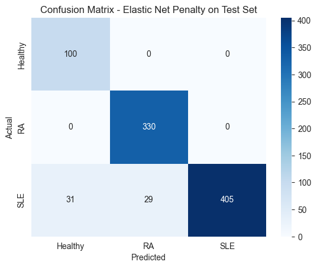

#### 1.2. Biomarker Identification

Using the **Elastic Net Penalty** model (the best-performing model), we analyzed the model coefficients to identify the most significant genes contributing to each class.

##### Top Genes for Each Class

**Table 3: Top 10 Genes Contributing to Each Class**

**a. Healthy vs Rest**

- **Top Positive Genes (Upregulated in Healthy Individuals)**:
  - TRIM69, GTF2IP12, DES, SMPD5, EME2, TTLL3, CYP1B1-AS1, MB, CKM, MYL2

- **Top Negative Genes (Downregulated in Healthy Individuals)**:
  - PINK1-AS, SNX32, GTF2IP1, HPR, CHRNB2, LINC01643, GET4, LINC01820, RHCE, PSMC3IP

**b. RA vs Rest**

- **Top Positive Genes (Upregulated in RA Patients)**:
  - TPI1P3, MIR378F, SLC23A3, CXCL9, AGMO, MTRNR2L9, RAX2, IGLJ4, MIR3908, MS4A6E

- **Top Negative Genes (Downregulated in RA Patients)**:
  - ANP32D, TCP11X2, TCP11X1, CPEB1, ACADL, PKD1L3, CLDN2, MIR651, TTC23L, GYS2

**c. SLE vs Rest**

- **Top Positive Genes (Upregulated in SLE Patients)**:
  - ANP32D, IFI27, SLC25A18, MIR6724-1, SLCO5A1, GYS2, AMY1B, CPEB1, CCDC175, HBBP1

- **Top Negative Genes (Downregulated in SLE Patients)**:
  - AGMO, IGLV3-30, MIR378F, CLRN1, SLC26A3, SPRY4-IT1, CTCFL, ISLR2, APOBEC4, SPATA42

**Figure 2: Top Genes Influencing Each Class**

- *Subfigure 2a: Healthy vs Rest*

  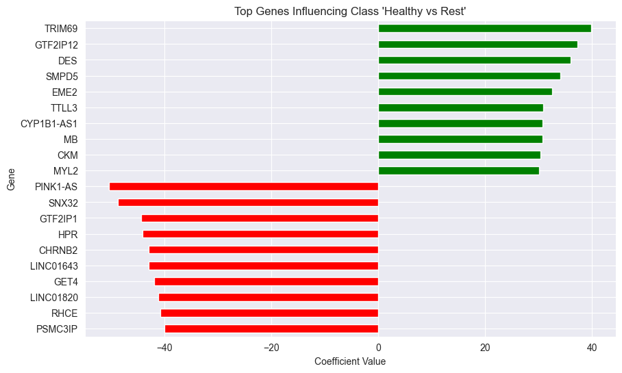

- *Subfigure 2b: RA vs Rest*

  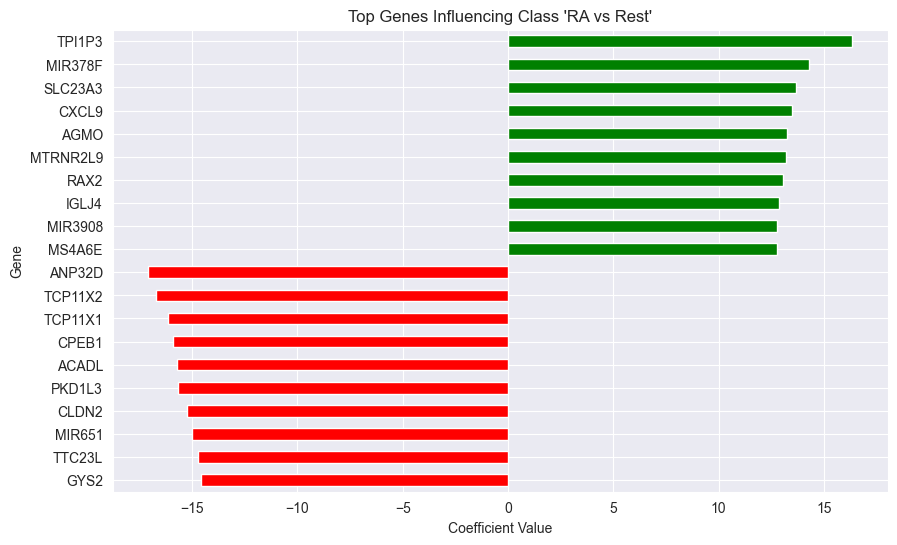

- *Subfigure 2c: SLE vs Rest*

  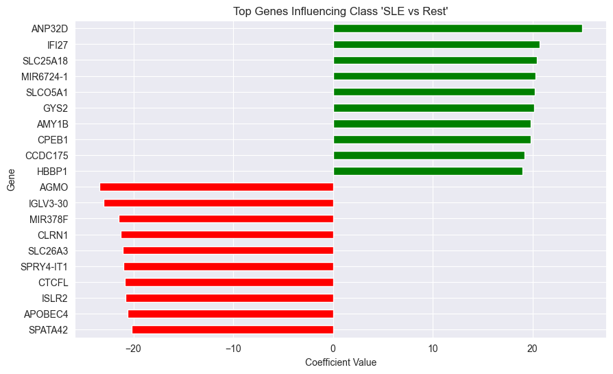

**Potential Biomarkers:**

- **ANP32D** and **IFI27** are highly significant for SLE, suggesting their potential as biomarkers.
- **MIR378F** appears as a positive contributor for RA and negative for SLE, indicating its role in differentiating between the two diseases.
- **TRIM69** and **GTF2IP12** are highly expressed in healthy individuals, contributing to their classification as "Healthy".

### 2. Advanced Model with XGBoost

#### 2.1. Test Set Performance Without Feature Selection

We trained an XGBoost model using all available features.

**Table 4: Test Set Performance of XGBoost Model (All Features)**

| **Metric**              | **Value** |
|-------------------------|-----------|
| **Accuracy**            | 74.75%    |
| **Precision (Macro)**   | 0.86      |
| **Recall (Macro)**      | 0.84      |
| **F1-Score (Macro)**    | 0.81      |
| **Weighted Avg Precision** | 0.85   |
| **Weighted Avg Recall**    | 0.75   |
| **Weighted Avg F1-Score**  | 0.74   |

**Table 5: Detailed Classification Report**

| **Class**     | **Precision** | **Recall** | **F1-Score** | **Support** |
|---------------|---------------|------------|--------------|-------------|
| **Healthy**   | 1.00          | 1.00       | 1.00         | 100         |
| **RA**        | 0.59          | 1.00       | 0.74         | 330         |
| **SLE**       | 1.00          | 0.51       | 0.68         | 465         |

**Figure 3: Confusion Matrix - XGBoost without Feature Selection**

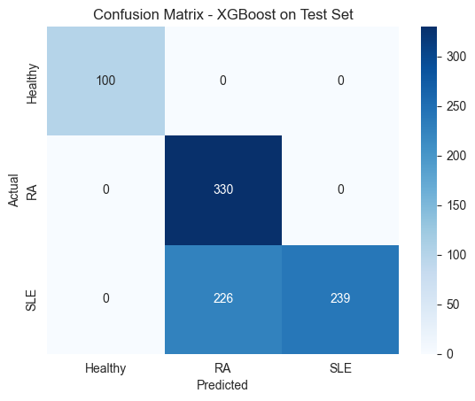

#### 2.2. Biomarker Identification Without Feature Selection

Using SHAP values, we identified the top genes contributing to each class.

**Table 6: Top 10 Genes Contributing to Each Class (All Features)**

| **Class**     | **Top Genes**                         |
|---------------|---------------------------------------|
| **Healthy**   | MATR3, TTLL3, GTF2IP1, MIR1244-2, ARL2BP, EGLN2, ZC3H11A, TRIM69, BORCS8, WDR83 |
| **RA**        | PKD1P1, SAMD1, IFI27, NPIPB3, NBPF20, PCBP1, PPP1R9B, NPIPB13, FOXN3, SAP18    |
| **SLE**       | GNAI2, MIR632, PNPLA2, CTDNEP1, PNPLA6, ZCCHC2, TUBA1C, SLCO5A1, NAP1L2, APOBEC3B-AS1 |

**Figure 4: Top Genes Contributing to Each Class (All Features)**

- *Subfigure 4a: Healthy*

  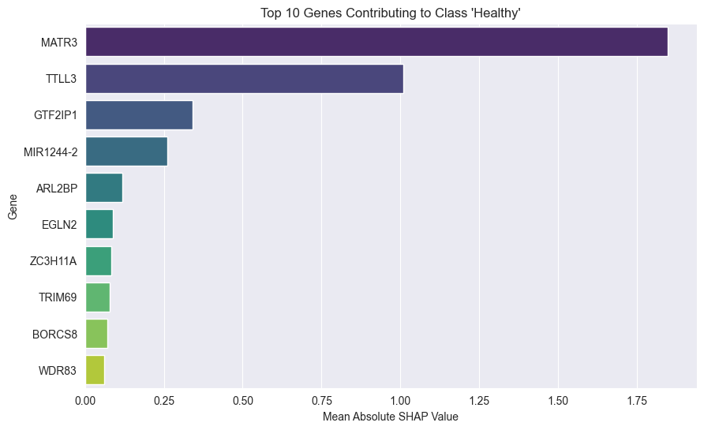   

- *Subfigure 4b: RA*

  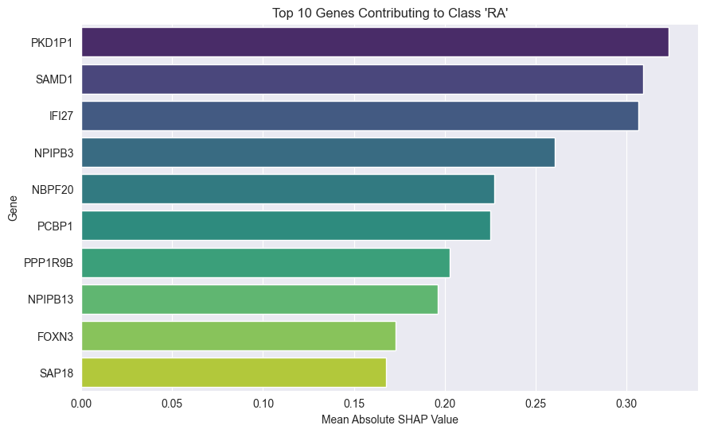

- *Subfigure 4c: SLE*

  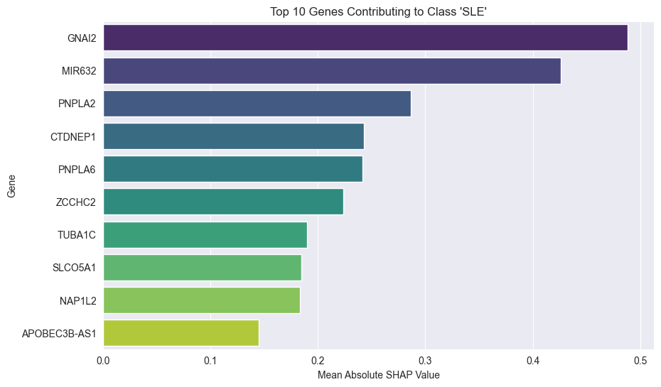

#### 2.3. Test Set Performance With Feature Selection

We selected the top 500 most important genes based on the XGBoost feature importances and retrained the model.

**Table 7: Test Set Performance of XGBoost Model (Top 500 Features)**

| **Metric**              | **Value** |
|-------------------------|-----------|
| **Accuracy**            | 75.42%    |
| **Precision (Macro)**   | 0.87      |
| **Recall (Macro)**      | 0.84      |
| **F1-Score (Macro)**    | 0.81      |
| **Weighted Avg Precision** | 0.85   |
| **Weighted Avg Recall**    | 0.75   |
| **Weighted Avg F1-Score**  | 0.75   |

**Table 8: Detailed Classification Report (Top 500 Features)**

| **Class**     | **Precision** | **Recall** | **F1-Score** | **Support** |
|---------------|---------------|------------|--------------|-------------|
| **Healthy**   | 1.00          | 1.00       | 1.00         | 100         |
| **RA**        | 0.60          | 1.00       | 0.75         | 330         |
| **SLE**       | 1.00          | 0.53       | 0.69         | 465         |

**Figure 5: Confusion Matrix - XGBoost with Top 500 Features**

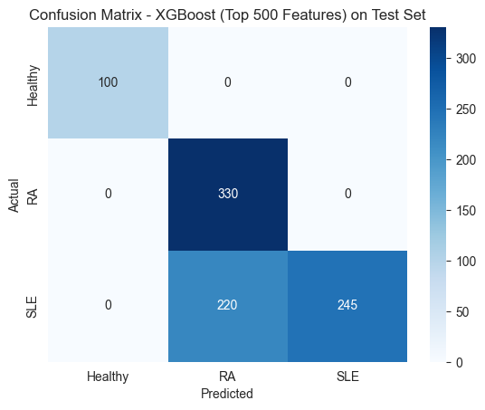

#### 2.4. Biomarker Identification With Feature Selection

**Table 9: Top 10 Genes Contributing to Each Class (Top 500 Features)**

| **Class**     | **Top Genes**                         |
|---------------|---------------------------------------|
| **Healthy**   | MATR3, TTLL3, GTF2IP1, MIR1244-2, MIR5193, NBPF25P, WBP2, WDR83, CTDNEP1, RBBP6 |
| **RA**        | PKD1P1, IFI27, NBPF20, SAMD1, PCBP1, NPIPB3, NPIPB13, FOXN3, TRAM1, F8A3       |
| **SLE**       | MIR632, GNAI2, PNPLA6, TUBA1C, CTDNEP1, PNPLA2, ZCCHC2, SNX32, SLCO5A1, SRGAP2B |

**Figure 6: Top Genes Contributing to Each Class (Top 500 Features)**

- *Subfigure 6a: Healthy*

  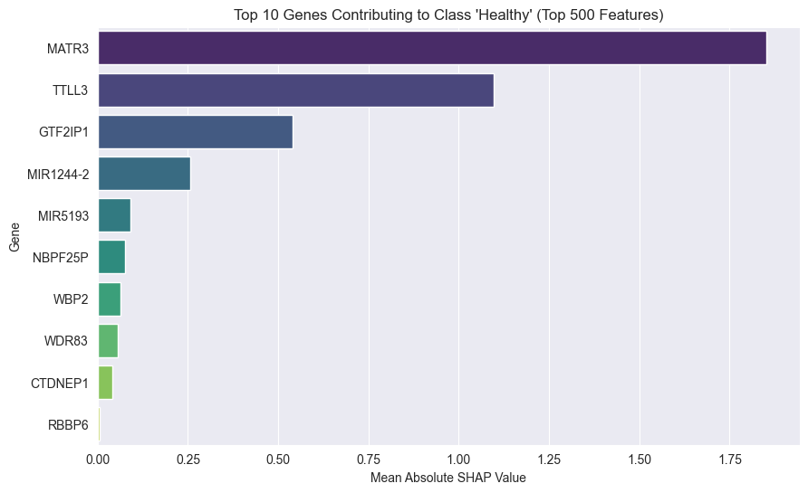  

- *Subfigure 6b: RA*

  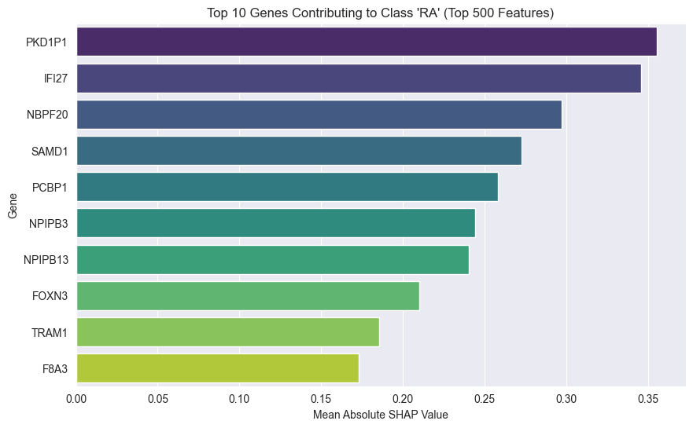

- *Subfigure 6c: SLE*

  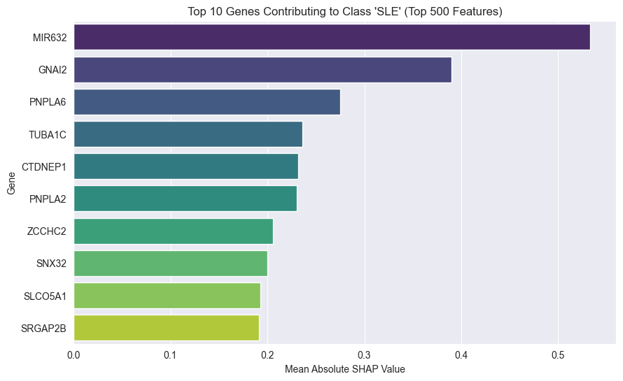

#### 2.5. Potential Biomarkers

- **Consistent Genes**: Genes like **MATR3**, **TTLL3**, and **GTF2IP1** are consistently significant for the Healthy class across both models.
- **RA Biomarkers**: **PKD1P1** and **IFI27** are important for RA classification.
- **SLE Biomarkers**: **MIR632** and **GNAI2** are significant for SLE, suggesting their potential as biomarkers.

### 3. Comparative Analysis of Approaches

**Table 10: Comparison of Model Performances**

| **Model**                      | **Accuracy** | **Precision (Macro)** | **Recall (Macro)** | **F1-Score (Macro)** |
|--------------------------------|--------------|-----------------------|--------------------|----------------------|
| **SGDClassifier (Elastic Net)** | **93.30%**   | **0.89**              | **0.96**           | **0.92**             |
| **XGBoost (All Features)**      | 74.75%       | 0.86                  | 0.84               | 0.81                 |
| **XGBoost (Top 500 Features)**  | 75.42%       | 0.87                  | 0.84               | 0.81                 |

**Insights:**

- The **SGDClassifier with Elastic Net Penalty** outperformed both XGBoost models significantly in all key metrics.
- Feature selection in XGBoost led to a slight increase in precision but did not substantially improve recall or F1-score.
- The high dimensionality of RNA-Seq data and limited sample size pose challenges for complex models like XGBoost without extensive tuning.
- The Elastic Net model effectively handled the sparsity and high dimensionality, providing better generalization to unseen data.

## Analysis

### Interpretation of the Results

- **Effectiveness of Elastic Net Regularization**:
  - The **SGDClassifier with Elastic Net Penalty** outperformed the XGBoost models, achieving the highest accuracy and best overall metrics.
  - Elastic Net combines L1 and L2 penalties, effectively handling the high dimensionality and sparsity of RNA-Seq data by performing feature selection and coefficient shrinkage.
  - This balance prevents overfitting and improves generalization to unseen data.

- **Challenges with XGBoost Models**:
  - **High Dimensionality**: RNA-Seq data has thousands of genes (features), which can overwhelm tree-based models like XGBoost, especially with limited training samples.
  - **Limited Sample Size**: The number of samples is relatively small compared to the number of features, leading to potential overfitting in complex models.
  - **Feature Selection Impact**: Reducing features to the top 500 genes provided only a marginal improvement, suggesting that important information may be spread across many genes.

- **Class Imbalance Issues**:
  - The dataset is imbalanced, with fewer Healthy samples compared to RA and SLE.
  - Class imbalance can bias the model towards majority classes, affecting recall and precision for minority classes.
  - Using class weights helped mitigate this issue, but some models still showed lower recall for the SLE class.

- **Model Complexity and Overfitting**:
  - The simpler linear model (SGDClassifier) with regularization handled the data better than the more complex XGBoost model.
  - XGBoost may require extensive hyperparameter tuning and more data to perform optimally on high-dimensional, sparse datasets.

- **Gene Expression Patterns**:
  - The overlap in gene expression patterns between RA and SLE, both being autoimmune diseases, may have contributed to the difficulty in distinguishing between them.

### Problems Faced

- **High Dimensionality vs. Limited Samples**:
  - The large number of genes relative to the number of samples poses a challenge for many machine learning models.
  - High dimensionality can lead to the "curse of dimensionality," where models struggle to find meaningful patterns without overfitting.

- **Data Sparsity**:
  - RNA-Seq data is inherently sparse, with many zero expression values.
  - Sparsity can affect the performance of models that do not handle sparse data well.

- **Feature Selection Limitations**:
  - The feature selection method based on XGBoost's feature importances may not have been sufficient.
  - Important genes may have been overlooked, or redundant features retained.

- **Need for Hyperparameter Tuning**:
  - Limited hyperparameter tuning was performed due to time constraints.
  - Models like XGBoost may benefit significantly from thorough tuning to optimize performance.

- **Interpretability vs. Performance Trade-off**:
  - While linear models are more interpretable, they may not capture complex non-linear relationships.
  - However, in this case, the linear model outperformed the non-linear model, suggesting that the relationships may be adequately captured linearly or that regularization played a more critical role.

- **Computational Resources**:
  - Handling high-dimensional data requires significant computational power.
  - Resource constraints may have limited the ability to perform extensive experiments or use more advanced techniques.

## Conclusion and Future Directions
- **Superior Performance of Elastic Net**:
  - The Elastic Net's ability to perform both feature selection and coefficient regularization made it well-suited for the high-dimensional, sparse nature of RNA-Seq data, leading to better generalization and higher accuracy.

- **XGBoost's Limited Performance**:
  - Despite its powerful capabilities, XGBoost struggled with the dataset's high dimensionality and sparsity without sufficient feature engineering or hyperparameter optimization, resulting in lower accuracy compared to the Elastic Net model.

- **Potential Biomarkers Identified**:
  - The Elastic Net model highlighted genes such as **ANP32D**, **IFI27**, and **MIR378F** as significant contributors to disease classification, suggesting their potential as biomarkers for RA and SLE.
  - These genes need further biological investigation to validate their roles in the respective diseases.

- **Future Directions**:
  - Exploring alternative feature selection methods, such as recursive feature elimination or mutual information, could enhance model performance.
  - Integrating domain knowledge to prioritize genes known to be associated with RA and SLE might improve biomarker discovery.
  - Implementing more sophisticated models or ensemble techniques, coupled with comprehensive hyperparameter tuning, could capture complex gene interactions more effectively.
